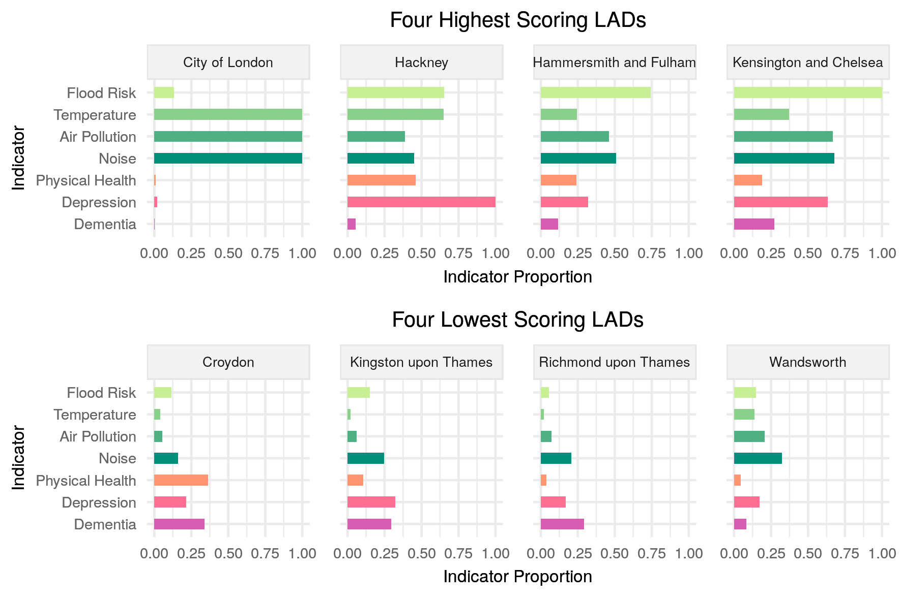

Introduction
============

In August 2019 I finally finished my MSc in Spatial Data Science and Visualisation at [CASA](https://www.ucl.ac.uk/bartlett/casa/). Below is the executive summary of my dissertation produced for Westminster City Council, who sponsored the project.

More information for various bits:

-   If you like what you see and want to read the entire project in full, [here's](https://github.com/greg-slater/dissertation/tree/master/pdf) the pdf.

-   High quality versions of all tables, charts, maps and diagrams in the pdf can be found [here](https://github.com/greg-slater/dissertation/tree/master/images).

-   If you'd like more information about (and links to) all the datasets used you can find that [here](https://github.com/greg-slater/dissertation/tree/master/data).

-   The slides for a presentation about the project I gave at Westmisnter City Council are available [here](https://github.com/greg-slater/dissertation/blob/master/pdf/Westminster%20Presentation%20-%20G%20Slater.pdf).

-   And finally, all the scripts used for data processing, modelling and analysis are [here](https://github.com/greg-slater/dissertation/tree/master/scripts). Pretty much everything was done in R. Tidyverse libraries were as ever, invaluable, but I'd like to give a shoutout in particular for the awesome [sf](https://github.com/r-spatial/sf) and [tmap](https://github.com/r-spatial/sf) libraries, which were used to make all the pretty maps.

  

Park Prioritisation: Building a Composite Indicator of Green Infrastructure Demand in London
============================================================================================

Abstract
--------

Policy documents at the national and local scale are increasingly recognising the value of Green Infrastructure in simultaneously delivering a wide range of different benefits. Many city policy documents, and in particular the most recent London Plan, are thus calling for GI interventions to help meet objectives as diverse as mitigating the risk of adverse weather from climate change or helping to improve the physical and mental health of urban populations. This research aims to investigate how such interventions might be optimised, through identifying the highest priority areas and also analysing these patterns of demand in order to unearth opportunities for multifunctional approaches.

Using the theoretical grounding of ecosystem services literature, the services that urban GI delivers are first defined and a wide range of open data sourced which can be used to represent demand for these services. These datasets are then combined in to a single measure of demand for GI. This process uses the methods of composite index construction to create a model of cumulative demand across all services. Once complete, uncertainty and sensitivity analysis are conducted to determine the robustness of the model results.

The overall results show that GI demand is focussed in the centre of the city, due to generally higher relative levels of pollution, ambient noise and temperature. But the model is also successful in identifying hotspots further away from the centre where GI interventions might have the greatest impact from being targeted to deliver health-related benefits. Results of cluster analysis using decomposed indicator scores from the index also highlight a number of focussed priority areas for particular services, for example flood-risk mitigation to the west of the city-centre.

EXECUTIVE SUMMARY
=================

Introduction
------------

Green Infrastructure (GI) can be defined as “a network of green spaces - and features such as street trees and green roofs - that is planned, designed and managed to provide a range of benefits” (GLA 2012). The subject of GI has become more prominent in urban policy documents as recognition has grown that the benefits it provides can help tackle the many environmental and social challenges cities face; both the London Plan and the Westminster City Plan (City of Westminster 2019) list a broad range of policy objectives which GI can help support, from promoting mental and physical health, supporting recreation and encouraging active travel, to improving air and water quality and enhancing biodiversity and ecological resistance. GI’s multifunctional nature represents a great opportunity for urban policy makers, but there is little research on how GI interventions might be targeted, or where particular functions should be prioritised. The aim of this research is to combine various datasets into a composite measure of ‘demand’ for urban GI, with the aim of providing a different perspective on the spatial priorities for GI in London and Westminster, generating insight into how multifunctionality objectives might be met, and ultimately aiding informed policy discussions on GI interventions.

Approach and Methodology
------------------------

A key aim was to use only free and open source software and publicly available data wherever possible, as well as produce results at the most granular spatial scale possible. This spatial scale was LSOA, and in order to improve the reliability of some of the statistical methods used, all 4,835 of London’s LSOAs were included and results shown for London overall as well as Westminster. The final model is fully reproducible and could be used by other London councils to analyse different areas.

The first step was gathering data. Here, a thorough reading of Westminster, London and national policy documents (table 1) alongside the framework of ‘Ecosystem Services’ was used to create a list of both the services provided by urban GI as well as the benefits they create, before sourcing data to act as an indicator of demand for each benefit (table 2).

Table 1: List of relevant policy quotes

Table 2: Services delivered by urban GI, along with benefits and datasets chosen for indicators

The methods of composite indicator construction used beyond this point are similar to those used to create the Index of Multiple Deprivation: indicator data is combined first into domain. The model ensures, for each area, that any high-demand score for one indicator or domain is not ‘cancelled out’ by a low-demand score in another - meaning that the final results emphasise those areas with the highest relative demand. Figure 1 shows the final model process. The aim was to create a holistic measure which represents demand across many dimensions. To investigate multifunctionality, the hope was also that cluster analysis of the final indicator scores might illuminate some patterns of indicator demand which could inform GI zoning strategies based on priorities for groups of services.

Figure 1: Final model process flow (PCA = Principal Component Analysis, Exponential Trans. = Exponential Transformation)

Main Outcomes
-------------

The Westminster map of the final indicator deciles for GI demand (figure 2) shows generally high demand levels across the borough, with the highest focussed around some of the most built up areas, as well as Paddington and Victoria train stations. Viewed alongside the maps for domain and indicator deciles it is clear that the high scores are driven almost entirely by the regulating indicators, and extremely high air pollution levels in particular. Very low scores in the depression and physical health indicators along with slightly lower levels in some regulating indicators contribute to the lowest demand scores to the west of Hyde Park and in the north of the borough by Regent’s Park.

 

Figure 2: Overall demand deciles for Westminster (1 = lowest demand, 10 = highest demand)

  

Westminster ranks 8th highest of all London boroughs for GI demand overall (shown in figure ), and the average indicator scores for the borough (figure ) make it clear again this is driven by high average levels in air pollution and noise indicators, while the average cultural indicator scores all remain low. Figure , which shows the average levels for the four highest and lowest scoring boroughs, illustrates that high regulating indicator scores are driving high overall demand in central London, though some of the highest scoring boroughs do score highly in at least one cultural indicator.

  

Figure 3: Mean GI demand index score by LAD, with decomposed indicator scores highlighted

Figure 4: Decomposed indicator scores - Westminster

Figure 5: Decomposed indicator scores - Four highest and four lowest scoring LADs

  

The results of a cluster analysis using indicator scores for all London LSOAs (figure 6) are mixed: the cumulative nature of the model means low-demand scores are de-emphasised and as a result large sections of London are classed as cluster 2 or 5, representing low demand across all indicators. However, the results are still valuable in identifying some areas where particular GI services should certainly be prioritised, for instance temperature regulation in cluster 1 areas.

  

Figure 6: Cluster descriptions

  

Examining the cluster results in closer detail for Westminster (figure ) shows a large area covered by cluster 3, which represents high demand across the temperature, air pollution and noise indicators, and areas on the north and western boundaries classed as low-demand cluster 2. Cluster 7 and 8 highlight areas where GI should be prioritised to deliver flood and temperature regulation services.

Figure 7: Cluster map for Westminster

Opportunities and Limitations
-----------------------------

The results show a clear value in an overall measure of GI demand and could be particularly useful in informing London-wide prioritisation. Such a composite measure allows for a holistic picture of demand which ensures all services are taken into consideration. The clustering results are effective in highlighting areas where particular services should be prioritised, and in Westminster this could certainly inform service prioritisation conversations or a zoning approach. There is certainly more to be done to capture an even broader picture of demand; data availability made it challenging to capture more than just health aspects in the cultural domain, and biodiversity was excluded entirely. Finding ways to incorporate other aspects could greatly increase the value of results. Furthermore, there is some tension between the scales used to create the composite indicator and at which results are analysed. A London-wide measure of demand - which was necessary to conduct clustering analysis - means the Westminster-level results may be quite general. Borough-level analysis could possibly produce a different representation of relative demand across the indicators.

Recommendations
---------------

The results show that there is certainly value in considering the demand for the different services GI can deliver. Arguably this value is even greater in areas like Westminster where creating new GI is extremely challenging; here it should be even more important to ensure that any new infrastructure is delivering the greatest possible value to those who will experience and use it, and that existing GI meets demand requirements. The approach taken here demonstrates that it is possible to start to understand this picture using entirely public data, and this picture could be widened by integrating additional datasets to cover other aspects of demand. The sort of framework used in this research could fit well alongside the value matrix developed for the ‘Wild West End’ project, and could be used to inform priorities for each function at a relatively granular spatial level across the borough.

References
----------

City of Westminster. 2019. “Westminster City Plan 2019-2040.” <https://www.westminster.gov.uk/cityplan2040>.

GLA. 2012. “All London Green Grid. London City Hall.” <https://www.london.gov.uk//what-we-do/environment/parks-green-spaces-and-biodiversity/all-london-green-grid>.
